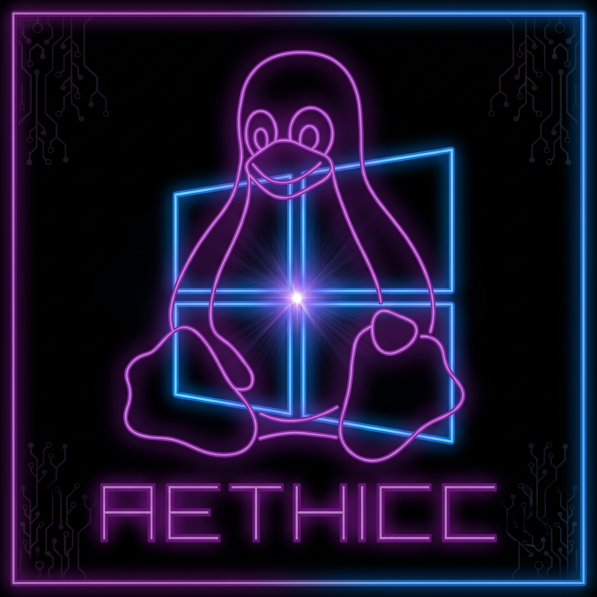

   

# TO INSTALL (LINUX)
_flatpak install --user Install_AeThiccLauncher.flatpak_

# TO INSTALL (Windows)
_Simply extract wherever you see fit and launch. Default paths point to common applications data folders by default, but you can change them in the settings_

# Ae Thicc Launcher (Unofficial SteamRIP Client)

Welcome to **Ae Thicc Launcher**, the ultimate desktop companion designed to seamlessly manage, download, and update your games library. 

This launcher doesn't just have an aesthetic; it has a **purpose**. 

In an industry increasingly dominated by the **aggressive monetization** of big corporations, **game preservation** and accessibility have never been **more critical**. **Ae Thicc Launcher** was built to ensure that everyone, regardless of their current financial capability, can access, play, and retain the games they love. We care deeply about true software ownership, giving you the tools to preserve your game files and your hard-earned savegames forever.

However, this freedom comes with a strong moral compass. We believe in voting with our wallets and supporting those who respect the medium. Our core motto, and the driving force behind this project, is simple:

> **"If a Developer or Publisher isn't aggressively monetizing, if they care about the customer and support them, THEN BUY THE GAME. THEY DESERVE IT."**

While many of our ethical features are still actively being developed behind the scenes, everything we build aims to strike this balance: do what you want with YOUR software, but always remember to reward the non-toxic, passionate developers who make this industry great.

---
## UPCOMING
*   **Steam Sales Mirror:** You got that game in your library. It's SO GOOD! And the devs? You heard great about them. We'll let you know when that piece of art is for sale on **STEAM** and/or **GOG** (nope, F* off Epic)
*   **Gold Tier:** Games from known Software Houses, verified by the community, in which you can rely forever. Non Toxic, Non Predatory, Quality made games that deserves a spotlight
*   **ESRB:** I'm about to be one of those who's gonna make a ton of dad jokes. It's not much, we care about privacy as much as we care about your children being safe, and you being a parent

## Key Features

### Smart Explorer & Downloader
*   **Integrated Catalog:** Instantly search through the entire SteamRIP database with a lightning-fast auto-completing search bar.
*   **Cloudflare Bypass:** A stealthy, built-in browser handles Cloudflare challenges automatically whenever possible, so your downloads never get stuck.
*   **Smart Resolver:** Automatically resolves and fetches direct download links from hosters.
*   **Auto-Extraction & Installation:** Games are downloaded, automatically extracted, and neatly placed into your designated "Watched Folders".

### Advanced Library Management
*   **Orphan Recovery:** Found an old folder? The launcher can automatically scan it, fetch the correct metadata from the web, and populate it into your library.
*   **Update Checker:** Compares your local game version against the web version. If a new update is available, it notifies you and helps you download the games directly (no patch files supported now, unless specified by the host game's page)
*   **Digital Store Links:** Automatically grabs official Steam and GOG store links so you can check out the official pages.

### Savegames Manager
*   **Ludusavi Integration:** Automatically fetches game informations to locate exactly where your game saves are stored, both for Windows and Linux (Proton) prefixes.
*   **Automated Backups:** Set a sync interval or let the launcher do the work. The built-in **Process Monitor** detects when you close a game and immediately backs up your latest save securely.
*   **Versioning:** Keeps a rotating history of your last 3 save snapshots, so you can always roll back if your file gets corrupted.

### Steam Integration & Linux/Deck Support
*   **One-Click Steam Injection:** Add your non-Steam games directly into your Steam Library with a single click.
*   **Automated Artwork:** The launcher downloads and applies Covers, Heroes, and Logos to your Steam Library entries dynamically!
*   **Proton Ready:** On Linux/Steam Deck, the launcher automatically configures Steam shortcuts to use `Proton GE` or `Proton Experimental`, getting you ready to play immediately.

---

## Getting Started & Setup

1.  **Configure Watched Folders:** Upon your first launch, head to the **Configuration Panel** under the **Settings** Menu. Add at least one "Watched Folder" (e.g., `C:\Games` or `/home/deck/Games`). This is where the launcher will scan for installed games and extract new downloads.
2.  **Configure Save Sync Folder:** In the settings, designate a folder where your savegame backups will be stored (default no forced designation, it has a default path OS based)
3.  **Search & Play:** Go to the Explorer tab, type a game name or paste a VALID URL (wink wink), hit Enter, and let the launcher do the heavy lifting!

---

## Technical Notes for Power Users
*   **Metadata:** Game metadata is stored locally inside each game's folder in a `steamrip_meta.json` file. You can back up your games just by moving the folder; the launcher will recognize them instantly on the next scan.
*   **Cache:** The Master Catalog caches locally and updates in the background unnecessary network requests.
*   **Network Drops:** The smart downloader supports resume functionality. If your connection drops, it will automatically attempt to resume up to 10 times. Results may vary depending on hosts.

---

## What's New in Version 1.1?
*   **Windows Launch System Overhauled:** Fixed and improved the game launching and executable detection logic for Windows environments, making it more reliable than ever.
*   **Graphical Improvements:** Polished UI elements, smoother SVG icon colorization, and refined neon gradients for an even better visual experience.
*   **Light Theme Compatibility:** The UI now gracefully supports and adapts to light themes, giving you more customization freedom without breaking the aesthetics.
*   **General Bugfixing:** Under-the-hood stability improvements, better network drop handling, and optimized background processes.

---
