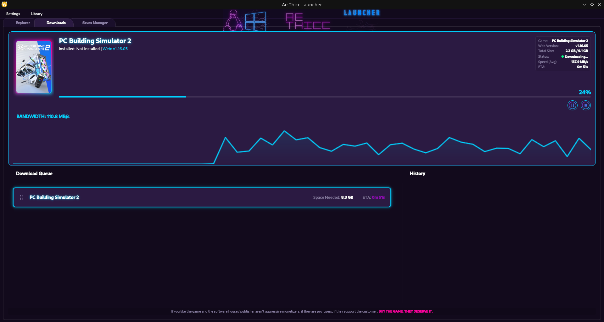
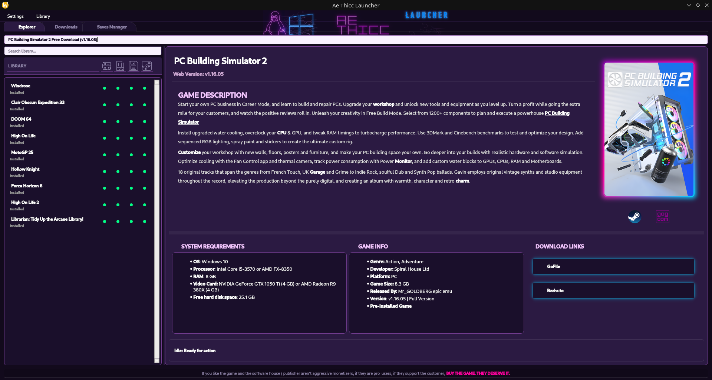

# TO INSTALL (LINUX)
_flatpak install --user Install_AeThiccLauncher.flatpak_

# TO INSTALL (Windows)
_Simply extract wherever you see fit and launch. Default paths point to common applications data folders by default, but you can change them in the settings_

# Ae Thicc Launcher (Unofficial SteamRIP Client) v1.1

Welcome to **Ae Thicc Launcher**, the ultimate desktop companion designed to seamlessly manage, download, and update your SteamRIP library. 
Built with a gorgeous Cyberpunk-inspired UI and powerful automation under the hood, this launcher takes the hassle out of manual extractions, updates, and savegame backups.

---

## What's New in Version 1.1?
*   **Windows Launch System Overhauled:** Fixed and improved the game launching and executable detection logic for Windows environments, making it more reliable than ever.
*   **Graphical Improvements:** Polished UI elements, smoother SVG icon colorization, and refined neon gradients for an even better visual experience.
*   **Light Theme Compatibility:** The UI now gracefully supports and adapts to light themes, giving you more customization freedom without breaking the aesthetics.
*   **General Bugfixing:** Under-the-hood stability improvements, better network drop handling, and optimized background processes.

---

## Key Features

### Smart Explorer & Downloader
*   **Integrated Catalog:** Instantly search through the entire SteamRIP database with a lightning-fast auto-completing search bar.
*   **Cloudflare Bypass:** A stealthy, built-in headless browser handles Cloudflare challenges automatically, so your downloads never get stuck.
*   **Smart Resolver:** Automatically resolves and fetches direct download links from hosters like MegaDB, Pixeldrain, Buzzheavier, Qiwi, Gofile, and FileDitch.
*   **Auto-Extraction & Installation:** Games are downloaded, automatically extracted, and neatly placed into your designated "Watched Folders".

### Advanced Library Management
*   **Orphan Recovery:** Found an old SteamRIP folder? The launcher can automatically scan it, fetch the correct metadata from the web, and populate it into your library.
*   **Update Checker:** Compares your local game version against the web version. If a new patch or update is available, it notifies you and helps you download the patch files directly.
*   **Digital Store Links:** Automatically grabs official Steam and GOG store links so you can check out the official pages.

### Next-Gen Savegames Manager
*   **Ludusavi Integration:** Automatically fetches the Ludusavi manifest to locate exactly where your game saves are stored, even translating Windows paths (`%appdata%`, `%userprofile%`, etc.) to Linux Proton prefixes.
*   **Automated Backups:** Set a sync interval or let the launcher do the work. The built-in **Process Monitor** detects when you close a game and immediately backs up your latest save securely.
*   **Versioning:** Keeps a rotating history of your last 3 save snapshots, so you can always roll back if your file gets corrupted.

### Steam Integration & Linux/Deck Support
*   **One-Click Steam Injection:** Add your non-Steam games directly into your Steam Library with a single click.
*   **Automated Artwork:** The launcher communicates with SteamGridDB to fetch and apply Covers, Heroes, and Logos dynamically.
*   **Proton Ready:** On Linux/Steam Deck, the launcher automatically configures Steam shortcuts to use `Proton GE` or `Proton Experimental`, getting you ready to play immediately.

---

## Getting Started & Setup

1.  **Configure Watched Folders:** Upon your first launch, head to the **Configuration Panel**. Add at least one "Watched Folder" (e.g., `C:\Games` or `/home/deck/Games`). This is where the launcher will scan for installed games and extract new downloads.
2.  **Configure Save Sync Folder:** In the settings, designate a folder where your savegame backups will be stored.
3.  **Search & Play:** Go to the Explorer tab, type a game name or paste a SteamRIP URL, hit Enter, and let the launcher do the heavy lifting!

---

## Ethical Piracy Disclaimer

As displayed within the launcher:
> *"If you like the game and the software house / publisher aren't aggressive monetizers, if they are pro-users, if they support the customer, **BUY THE GAME. THEY DESERVE IT.***"

Support good developers and the gaming industry whenever you can.

---

## Technical Notes for Power Users
*   **Metadata:** Game metadata is stored locally inside each game's folder in a `steamrip_meta.json` file. You can back up your games just by moving the folder; the launcher will recognize them instantly on the next scan.
*   **Cache:** The Master Catalog caches locally and updates in the background every 12 hours to prevent unnecessary network requests.
*   **Network Drops:** The smart downloader supports resume functionality (`Range` headers). If your connection drops, it will automatically attempt to resume up to 10 times.
